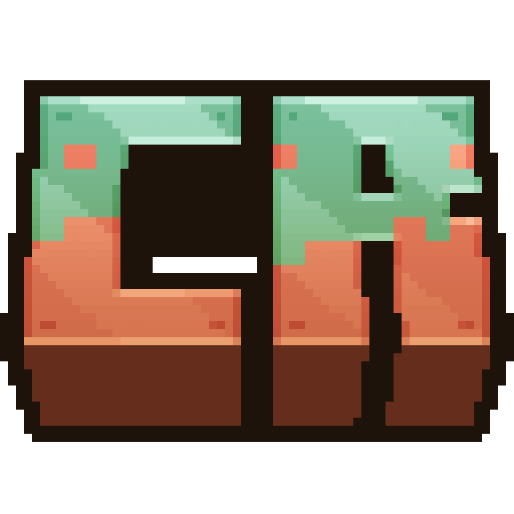

# Createrency

✨ This is a Create-based tech modpack that combines [Sugar](https://github.com/HarvelsX/Sugar) and [Create](https://github.com/Fabricators-of-Create/Create) with add-ons and integrations.

🪄 With Sugar, this modpack gives you great performance on different configurations of personal computers, while allowing you to keep all the things you are so used to: _CTM_, _CIT_, _Capes_, _CEM_, _Zoom_ and etc from **Optifine**.

🎉 And all this is already available and ready to play, you only need to install modpack and enjoy your gameplay!

Thank you 💖 for being there and have a nice game!

## 📦 Optional Resources

_\* resources that you can install in the assembly, the settings for these resources are already provided._

### Mods
- [\*Mouse Wheelie](https://modrinth.com/mod/mouse-wheelie/versions?g=1.20.1)
- [\*Sound Physics Remastered](https://modrinth.com/mod/sound-physics-remastered/versions?l=fabric&g=1.20.1)
- [\*Xaero's Minimap](https://modrinth.com/mod/xaeros-minimap/versions?l=fabric&g=1.20.1)
- [\*Smooth Swapping](https://modrinth.com/mod/smooth-swapping/versions?l=fabric&g=1.20.1)
- [Better Third Person](https://modrinth.com/mod/better-third-person/versions?l=fabric&g=1.20.1)
- [\*First-person Model](https://modrinth.com/mod/first-person-model/versions?l=fabric&g=1.20.1)
- [\*AppleSkin](https://modrinth.com/mod/appleskin/versions?l=fabric&g=1.20.1)
- [\*3D Skin Layers](https://modrinth.com/mod/3dskinlayers/versions?l=fabric&g=1.20.1)
- [Controlify](https://modrinth.com/mod/controlify)
- [Sounds](https://modrinth.com/mod/sound/versions?l=fabric&g=1.20.1)
- [AmbientSounds](https://modrinth.com/mod/ambientsounds/versions?g=1.20.1&l=fabric)

### Shader packs

- [\*Sildur's Enhanced Default](https://adfoc.us/392322104373107)

## 📦 Resources

> To use the supplied shader settings, use the Iris tools to import them:
> `BSL_v8.2.04.zip.txt`, `ComplementaryReimagined_r5.3.zip.txt`, `ComplementaryUnbound_r5.3_NS.zip.txt`, `ComplementaryUnbound_r5.3.zip.txt`, `Sildur's+Enhanced+Default+v1.171+Fancy.zip.txt`
